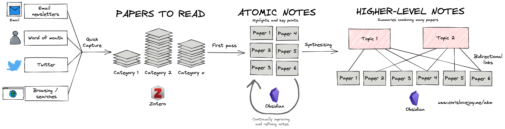

# An Academic Knowledge Management System
_by [Dr Chris Lovejoy](https://www.chrislovejoy.me)._

The purpose of an **academic knowledge management** (AKM) system is to enable you to:
1. Aggregate and organise academic papers of interest
2. Extract and synthesise their key findings and insights
3. Combine these insights for a birds-eye view of a research field's cutting edge
4. Exporting references and citations when conducting a research project

This folder contains a template academic knowledge management system. It is best utilised by using the free [Obsidian](https://obsidian.md/) software.

For a more detailed description of this system, its motivations and configuration, see [this article](https://chrislovejoy.me/akm).

(NOTE: This README is best read in Obsidian, to enable all links to be visualised correctly and followed.)

---

## How does this system work?

The pipeline works as follows:

### 1. Find an interesting paper
- Save it into a citation manager (e.g. Zotero - using the chrome extension ["Zotero Connector"](https://chrome.google.com/webstore/detail/zotero-connector/ekhagklcjbdpajgpjgmbionohlpdbjgc))
- Configure that citation manage to automatically download the PDF and save it into the folder '3_PDFs' (using the [Zotfile plugin](http://zotfile.com))

(I use a folder structure to organise my papers in Zotero, with folders for projects and for areas of interest - [[Zotero_folders.png|see this screenshot]].)

### 2. Read a paper
- Create a note within folder '1_papers' with the title of the paper (see [[Blockchain-Based Access Control Scheme for Secure Shared Personal Health Records over Decentralised Storage|this example]])
- Add the [[paper_template]] template (using the ['Templater' Obsidian plug-in](https://github.com/SilentVoid13/Templater))
- Read the paper in PDF format while adding highlights
- Export those highlights into markdown format (using the [Zotero Mdnotes plugin](https://github.com/argenos/zotero-mdnotes))
- Put those highlights into the note that was created (in the 'Highlights' section)
- Write a summary and high-level thoughts in own words

### 3. Process the paper insights
- When reading many papers on a particular topic, create a note for that topic within the folder '2_topics' (see example [[Decentralised storage of health data|here]])
- Add the [[topic_template]] template (using the ['Templater' Obsidian plug-in](https://github.com/SilentVoid13/Templater))
- Create links for all relevant papers that you read from within that note
- Review the summary and high-level thoughts for all linked papers and write a topic summary

Over time, these summaries can be improved and serve as a key self-reference on topics of interest.

### 4. Export the citations
- Generate a unique citation key for each paper (using the [Better BibTex plugin](https://retorque.re/zotero-better-bibtex/) for Zotero) and include these in each papers markdown note
- When writing the research paper, add citations using \cite{citation_key}. These will automatically be recognised in LaTeX.
- Export the bib file from Zotero and add to LaTeX.

*NOTE: There is now an [Obsidian Citation Plugin](https://github.com/hans/obsidian-citation-plugin) which may circumvent some elements of this pipeline.*

---

## Examples

Some example papers are shown here: 
- [[Blockchain-Based Access Control Scheme for Secure Shared Personal Health Records over Decentralised Storage]]
- [[GluNet - A Deep Learning Framework for Accurate Glucose Forecasting]]

An example topic-level note is shown here:
- [[Decentralised storage of health data]]
